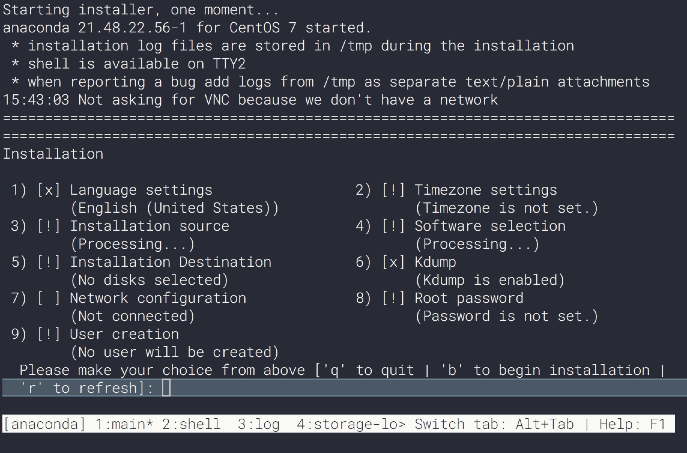
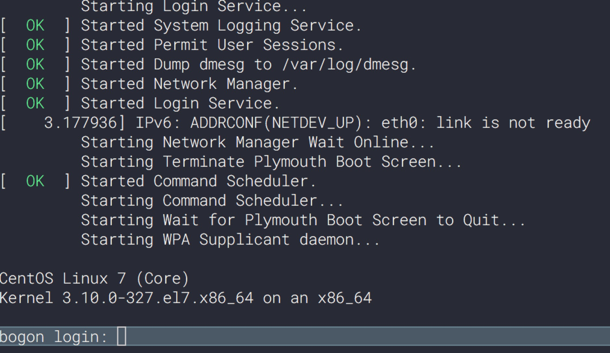

Running centos 7 on xhyve
--------------------------

# 安装xhyve

```
$ brew install xhyve
```

# 下载CentOS镜像

```
$ wget http://linux.adsl.by/centos/7/isos/x86_64/CentOS-7-x86_64-Minimal-1511.iso
```

# 提取kernel和ramdisk镜像

> centos 镜像是hybrid file system的（可以直接dd 到u盘烧录的），而OS X 的hdiutil 不支持直接挂载，因此需要做如下处理

```
$ dd if=/dev/zero bs=2k count=1 of=/tmp/tmp.iso
$ dd if=CentOS-7-x86_64-Minimal-1511.iso bs=2k skip=1 >> /tmp/tmp.iso

$ hdiutil attach /tmp/tmp.iso
$ cp /Volumes/CentOS\ 7\ x86_64/isolinux/{vmlinuz,initrd.img} .

$ umount /Volumes/CentOS\ 7\ x86_64
$ rm /tmp/tmp.iso
```

# 创建虚拟磁盘

用于安装OS

```
＃8GB
$ dd if=/dev/zero of=hdd.img bs=1g count=8
```

# 安装CentOS

```
$ sudo ./install_centos.sh
```

成功的话，会出现如下界面




然后进行设置安装，安装完毕时，安装程序显示：

```
Installation complete.  Press return to quit
```

此时，先不要按`回车`，需要切换到另外一个shell，把安装后的kernel和ramdisk镜像复制出来


# 复制安装后的kernel和ramdisk镜像

```
//entos安装工具anaconda使用的是tmux, 使用其功能键切换到一个shell
$ Ctrl-b 2

//检查虚拟机ip地址(如eth0的ip为192.168.64.25)
$ ip addr

//如果安装的时候没有设置网络，则需要使用nmtui/dhclient等工具设置并且激活一下
$ nmtui or dhclient eth0

//进入新安装虚拟机的boot目录
$ cd /mnt/sysimage/boot/

//启动python简易web服务器
$ python -m SimpleHTTPServer

//在host上下载kernel等文件
$ wget http://192.168.64.25:8000/vmlinuz-3.10.0-327.el7.x86_64
$ wget http://192.168.64.25:8000/initramfs-3.10.0-327.el7.x86_64.img
```

# 关闭虚拟机

切换回第一个shell，然后关闭虚拟机
```
$ Ctrl-b 1
按回车
```

# 查看文件

```
$ ll
-rw-r--r--@ 1 xjimmy  staff   603M 12 10  2015 CentOS-7-x86_64-Minimal-1511.iso
-rw-r--r--  1 xjimmy  staff   8.0G  8 10 00:21 hdd.img
-rw-r--r--@ 1 xjimmy  staff    18M  8  9 23:51 initramfs-3.10.0-327.el7.x86_64.img
-r--r--r--  1 xjimmy  staff    37M  8  9 23:37 initrd.img
-rwxr-xr-x  1 xjimmy  staff   491B  8  9 23:42 install_centos.sh
-rwxr-xr-x  1 xjimmy  staff   623B  8 10 00:03 run_centos.sh
-r-xr-xr-x  1 xjimmy  staff   4.9M  8  9 23:37 vmlinuz
-rw-r--r--@ 1 xjimmy  staff   4.9M 11 20  2015 vmlinuz-3.10.0-327.el7.x86_64
```

# 运行centos

```
$ sudo ./run-centos.sh
```

见到如下画面，表示启动成功

